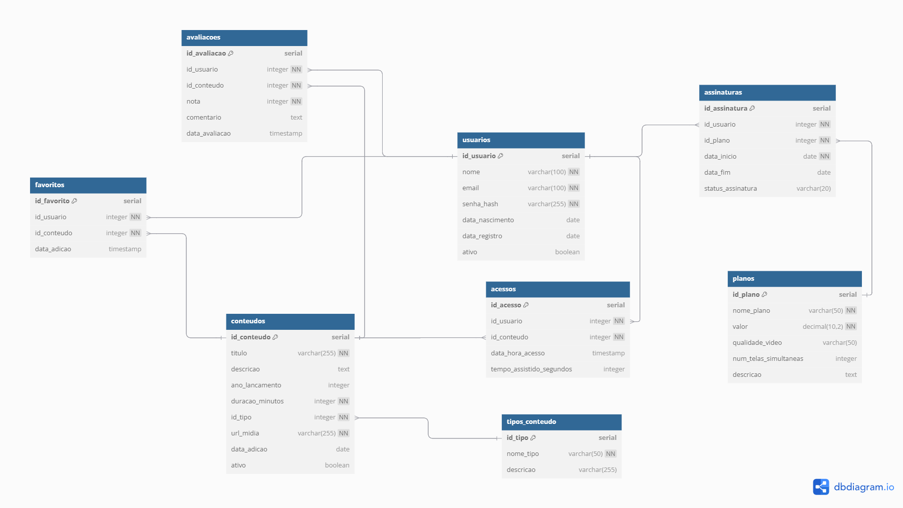

# Projeto de Banco de Dados: Sistema de Streaming

## Descrição

Este projeto consiste no desenvolvimento de um banco de dados relacional para um sistema de streaming, semelhante a plataformas como Netflix ou Prime Video. Ele foi concebido como trabalho final da disciplina de Banco de Dados II.

## Funcionalidades Principais

O banco de dados suporta:

* Cadastro de usuários e tipos de conteúdo.
* Registro de acessos e tempo assistido.
* Gerenciamento de planos de assinatura.
* Avaliações, favoritos e controle de assinaturas.

## Tecnologias Utilizadas

* **PostgreSQL**: SGBD relacional.
* **SQL (DDL, DML)**: Linguagem para manipulação e definição de dados.

## Estrutura do Banco de Dados

Nosso banco de dados é composto por 8 tabelas principais:

* `usuarios`
* `tipos_conteudo`
* `conteudos`
* `acessos`
* `planos`
* `assinaturas`
* `avaliacoes`
* `favoritos`

## Estrutura do Repositório

O projeto está organizado na seguinte estrutura de diretórios para melhor modularidade e clareza:

.
├── database/ # Contém todos os scripts e documentação relacionados ao banco de dados
│ ├── ddl/ # Scripts de Data Definition Language (criação de tabelas)
│ │ └── create_tables.sql # Script principal de criação do esquema do DB
│ ├── dml/ # Scripts de Data Manipulation Language (inserção de dados)
│ │ └── insert_data.sql # Script de inserção de dados de exemplo
│ ├── functions/ # Scripts de Functions e Procedures (implementações futuras)
│ ├── triggers/ # Scripts de Triggers (implementações futuras)
│ ├── views/ # Scripts de Views (implementações futuras)
│ └── docs/ # Documentação adicional do banco de dados
│ └── Modelo_Físico.png # Diagrama do modelo físico do DB
├── src/ # Código fonte de aplicações (ex: CRUD em linguagem de programação)
│ └── [linguagem_escolhida]/ # Ex: python/, javascript/ - para o CRUD (implementação futura)
├── .gitignore # Arquivo para o Git ignorar arquivos e pastas específicos
├── README.md # Este arquivo de documentação do projeto
└── LICENSE # Informações sobre a licença de uso do código (se aplicável)

## Progresso e Próximas Fases do Projeto

Este `README.md` será atualizado continuamente, refletindo o progresso das implementações e a evolução do projeto.

### Fase 1: Modelagem e Estrutura Inicial (Concluída)

* Criação e otimização do diagrama do modelo físico.
* Geração do script SQL de criação do banco de dados (`database/ddl/create_tables.sql`).
* Geração do script SQL para popular as tabelas com dados de exemplo (`database/dml/insert_data.sql`).
* Configuração inicial da estrutura de pastas do repositório.

### Fase 2: Implementação de Objetos Avançados (Próxima)

* Documentação do dicionário de dados do modelo físico.
* Implementação de **3 Functions/Procedures**, **1 Trigger** e **3 Views**, além de **índices** para as tabelas.
* Justificativa da escolha de cada objeto.

### Fase 3: Desenvolvimento do CRUD

* Desenvolvimento de um **CRUD** (Create, Read, Update, Delete) para interação com o banco de dados em uma linguagem de programação.

### Fase Final: Entrega e Apresentação

* Conclusão total do projeto e preparação para a apresentação.

## Como Configurar e Rodar

1.  Clone este repositório: `git clone https://github.com/Xandetds/Projeto-BD.git`
2.  Navegue até a pasta do projeto: `cd Projeto-BD`
3.  Crie o banco de dados `streaming_db` no PostgreSQL.
4.  Execute os scripts SQL na ordem:
    * `psql -U seu_usuario -d streaming_db -f database/ddl/create_tables.sql`
    * `psql -U seu_usuario -d streaming_db -f database/dml/insert_data.sql`
    *(Os caminhos acima assumem a estrutura de pastas proposta.)*

## Autores

* **Alexandre Tibes da Silva**
* **Guilherme Victor Machado**
* **Lucas Hoffmann**
*(Estudantes de Engenharia de Software, Unisatc.)*

## Licença

Este projeto está licenciado sob a Licença MIT.