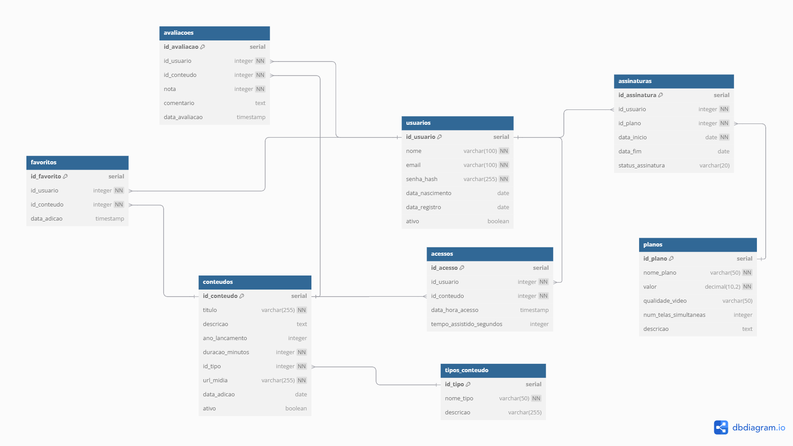

# Projeto de Banco de Dados: Sistema de Streaming

## Descrição

Este projeto consiste no desenvolvimento de um banco de dados relacional para um sistema de streaming, semelhante a plataformas como Netflix ou Prime Video. Ele foi concebido como trabalho final da disciplina de Banco de Dados II.

## Funcionalidades Principais

O banco de dados suporta:

* Cadastro de usuários e tipos de conteúdo.

* Registro de acessos e tempo assistido.

* Gerenciamento de planos de assinatura.

* Avaliações, favoritos e controle de assinaturas.

## Tecnologias Utilizadas

* **PostgreSQL**: SGBD relacional.

* **SQL (DDL, DML)**: Linguagem para manipulação e definição de dados.

* **Python**: Linguagem de programação para o backend da aplicação.

* **Flask**: Microframework web para construção da API e interface do CRUD.

## Estrutura do Banco de Dados

Nosso banco de dados é composto por 8 tabelas principais:

* `usuarios`

* `tipos_conteudo`

* `conteudos`

* `acessos`

* `planos`

* `assinaturas`

* `avaliacoes`

* `favoritos`



## Estrutura do Repositório

O projeto está organizado na seguinte estrutura de diretórios para melhor modularidade e clareza:

<pre>
.
├── database/                   # Contém todos os scripts e documentação relacionados ao banco de dados
│   ├── ddl/                    # Scripts de Data Definition Language (criação de tabelas)
│   │   └── create_tables.sql   # Script principal de criação do esquema do DB
│   ├── dml/                    # Scripts de Data Manipulation Language (inserção de dados)
│   │   └── insert_data.sql     # Script de inserção de dados de exemplo
│   ├── functions/              # Scripts de Functions e Procedures
│   ├── triggers/               # Scripts de Triggers
│   ├── views/                  # Scripts de Views
│   └── docs/                   # Documentação adicional do banco de dados
│       └── Modelo_Físico.png   # Diagrama do modelo físico do DB
├── src/                        # Código fonte de aplicações 
│   └── python/                 # Código Python da aplicação Flask
│       ├── .venv/              # Ambiente virtual Python 
│       ├── templates/          # Templates HTML 
│       │   ├── index.html
│       │   ├── add_user.html
│       │   └── edit_user.html
│       ├── app.py              # Arquivo principal da aplicação Flask
│       └── requirements.txt    # Dependências do Python
├── .gitignore                  # Arquivo para o Git ignorar arquivos e pastas específicas
└── README.md                   # Este arquivo de documentação do projeto
</pre>

## Progresso e Próximas Fases do Projeto

### Fase 1: Modelagem e Estrutura Inicial

* Criação e otimização do diagrama do modelo físico.

* Geração do script SQL de criação do banco de dados (`database/ddl/create_tables.sql`).

* Geração do script SQL para popular as tabelas com dados de exemplo (`database/dml/insert_data.sql`).

* Configuração inicial da estrutura de pastas do repositório.

### Fase 2: Implementação de Objetos Avançados

* Documentação do dicionário de dados do modelo físico.

* Implementação de **3 Functions/Procedures**, **1 Trigger** e **3 Views**, além de **índices** para as tabelas.

* Justificativa da escolha de cada objeto.

### Fase 3: Desenvolvimento do CRUD

* Desenvolvimento de um **CRUD** (Create, Read, Update, Delete) para interação com o banco de dados em uma linguagem de programação.

## Como Configurar e Rodar

Siga estes passos para configurar e executar o projeto localmente:

1.  **Clone o Repositório:**
    ```bash
    git clone [https://github.com/Xandetds/Projeto-BD.git](https://github.com/Xandetds/Projeto-BD.git)
    ```
    Navegue até a pasta do projeto clonado:
    ```bash
    cd Projeto-BD
    ```

2.  **Configurar o Banco de Dados PostgreSQL:**
    * Abra o **pgAdmin** ou **DBeaver** (ou use o `psql` no terminal).
    * **Crie um novo banco de dados** chamado `sistema_streaming` (tudo minúsculo).
        * Exemplo SQL: `CREATE DATABASE sistema_streaming;`
    * **Conecte-se** a este novo banco de dados no seu cliente SQL.
    * **Execute o script de Definição de Dados (DDL):**
        * Abra o arquivo `database/ddl/create_tables.sql` e execute todo o seu conteúdo. (Este script já inclui a criação de tabelas, a coluna `visualizacoes` e os `CREATE INDEX`).
    * **Execute o script de Manipulação de Dados (DML):**
        * Abra o arquivo `database/dml/insert_data.sql` e execute todo o seu conteúdo para popular as tabelas com dados de exemplo.

3.  **Configurar e Rodar a Aplicação Python (Flask):**
    * Navegue até a pasta da aplicação Python:
        ```bash
        cd src/python
        ```
    * **Crie e ative o Ambiente Virtual:**
        ```bash
        python -m venv .venv
        .venv\Scripts\Activate.ps1   # Para PowerShell
        # ou source .venv/bin/activate # Para Git Bash/Linux
        ```
    * **Instale as Dependências:**
        ```bash
        pip install -r requirements.txt
        ```
    * **Execute a Aplicação Flask:**
        ```bash
        python app.py
        ```
    * Abra seu navegador e acesse: `http://127.0.0.1:5000/`

## Bugs Notáveis e Lições Aprendidas

* **Problema:** Erro "relação 'public.usuarios' não existe" no Flask, mesmo com tabelas criadas e populadas no PostgreSQL.
* **Causa:** O banco de dados (`sistema_streaming`) havia sido criado e populado antes do desenvolvimento/integração do CRUD em Flask.
* **Solução:** Apagar e recriar o banco de dados do zero, executando `create_tables.sql` e `insert_data.sql` novamente.
* **Lição:** Em ambientes de desenvolvimento, é uma prática altamente recomendada garantir um **estado inicial "limpo" do banco de dados, especialmente após grandes mudanças de ambiente ou longa pausa no desenvolvimento. Isso garante que a aplicação está interagindo com a versão esperada do schema e dos dados.

## Autores

* **Alexandre Tibes da Silva**

* **Guilherme Victor Machado**

* **Lucas Hoffmann**
    
*(Estudantes de Engenharia de Software, Unisatc.)*
